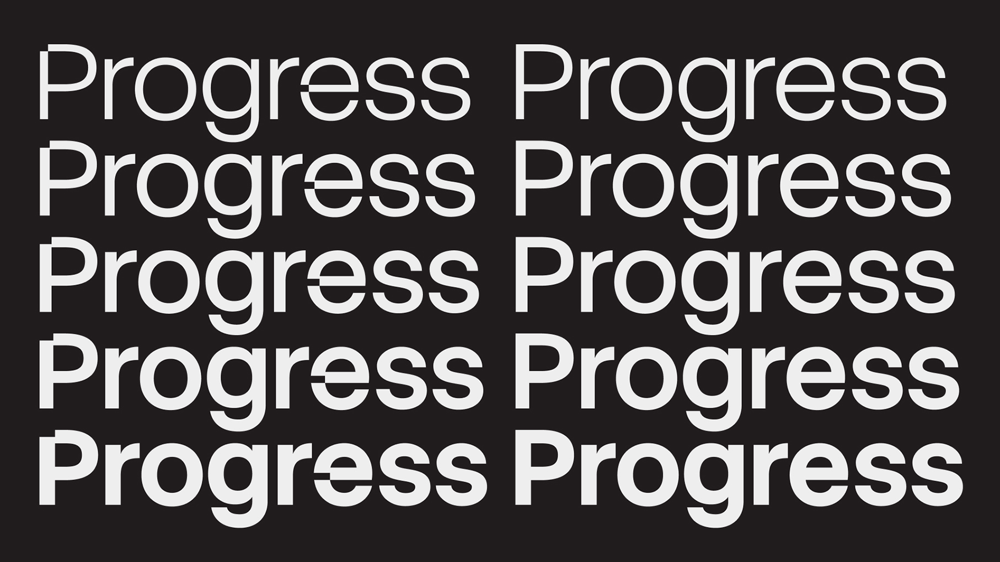

# Stack Sans

[![][Fontspector]](https://googlefonts.github.io/googlefonts-project-template/fontspector/fontspector-report.html)
[![][OpenType]](https://googlefonts.github.io/googlefonts-project-template/fontspector/fontspector-report.html)
[![][Universal]](https://googlefonts.github.io/googlefonts-project-template/fontspector/fontspector-report.html)
[![][Google Fonts]](https://googlefonts.github.io/googlefonts-project-template/fontspector/fontspector-report.html)
[![][Glyphset]](https://googlefonts.github.io/googlefonts-project-template/fontspector/fontspector-report.html)

[Fontspector]: https://img.shields.io/endpoint?url=https%3A%2F%2Fgooglefonts.github.io%2Fgooglefonts-project-template%2Fbadges%2FFontspectorQA.json
[OpenType]: https://img.shields.io/endpoint?url=https%3A%2F%2Fgooglefonts.github.io%2Fgooglefonts-project-template%2Fbadges%2FOpentypeSpecificationChecks.json
[Universal]: https://img.shields.io/endpoint?url=https%3A%2F%2Fgooglefonts.github.io%2Fgooglefonts-project-template%2Fbadges%2FUniversalProfileChecks.json
[Google Fonts]: https://img.shields.io/endpoint?url=https%3A%2F%2Fgooglefonts.github.io%2Fgooglefonts-project-template%2Fbadges%2FFontFileChecks.json
[Outline Correctness]: https://img.shields.io/endpoint?url=https%3A%2F%2Fgooglefonts.github.io%2Fgooglefonts-project-template%2Fbadges%2FOutlineCorrectnessChecks.json
[Glyphset]: https://img.shields.io/endpoint?url=https%3A%2F%2Fgooglefonts.github.io%2Fgooglefonts-project-template%2Fbadges%2FGlyphsetChecks.json

Stack Sans is a sans serif font family rooted in modernist inspiration, striking a balance between timelessness and innovation. Its distinctive notched detailing, inspired by the building process, creates a recognizable signature that is unique to Stack Sans. Crafted uniquely for Stack Overflow, Stack Sans has both a hedline and text style that allow for typographic expression regardless of scale.

## About

Koto is a brand and digital agency with studios in Berlin, London, Los Angeles, New York, and Sydney. We bring optimism, craft and rigor to every brief; collaborating with today’s most impactful companies and the founders defining a better tomorrow to unlock the true potential of their brands. Founded in 2015 by Caroline Matthews (COO), James Greenfield (CEO), and Jowey Roden (CCO), we have shaped some of the world's leading brands, including Airbnb, Amazon Music, Discord, Fiverr, Glassdoor, Pleo, Qonto, Skyscanner, Sonos, Uber Eats, Venmo, and WhatsApp.

[Koto Website](https://koto.studio/)

## Changelog

When you update your font (new version or new release), please report all notable changes here, with a date.
[Font Versioning](https://github.com/googlefonts/gf-docs/tree/main/Spec#font-versioning) is based on semver.

**03 October 2025. Version 1.000**

- First release / 4 masters / 12 styles

## License

This Font Software is licensed under the SIL Open Font License, Version 1.1.
This license is available with a FAQ at https://openfontlicense.org

## Repository Layout

This font repository structure is inspired by [Unified Font Repository v0.3](https://github.com/unified-font-repository/Unified-Font-Repository), modified for the Google Fonts workflow.
